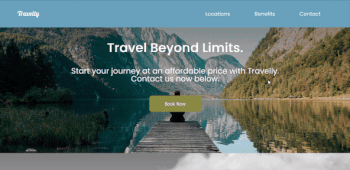

# Travelly

Travelly is a responsive mock travel agency web page. The web design is from The Creative Javascript Course by [Developed By Ed](https://developedbyed.com/p/the-creative-javascript-course), with my own adaptations.

## Technologies Used

HTML, CSS, GIT, Bash.

## Personal Learnings

This project was my first time using animations with keyframes, which I enjoyed and intend on using more in the future. I also practiced a different approach to making responsive websites. In this project I used rem instead of pixels throughout, which made this project more responsive than previous works I have done. I also used max-width for media queries instead of a min-width. Although I found this approach easier, it also meant I needed more breakpoints than the min-width method. In the future I will continue to experiment with both approaches.

## Installation Instructions

To run Travelly, download this project and then run on a local server of your choice.

#### Written by Christine Lyston
#### Date: September 2020
